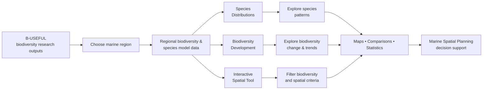
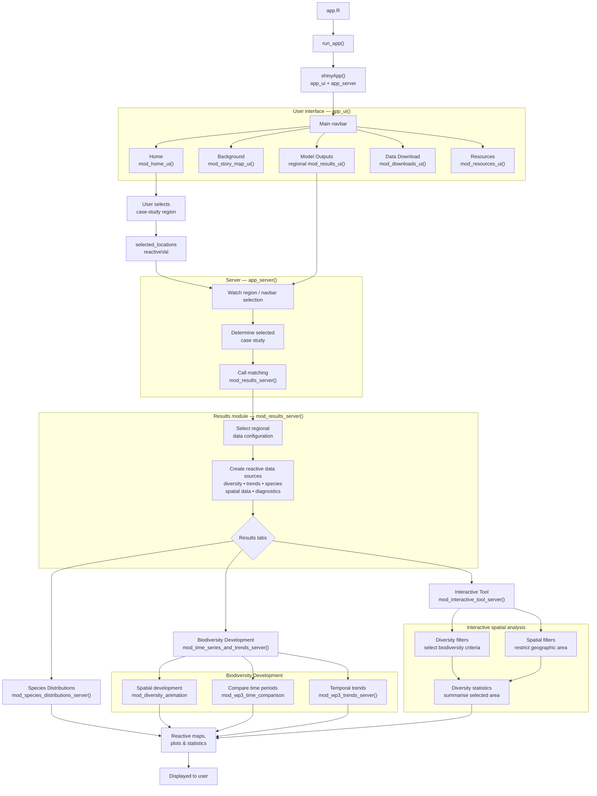

# B USEFUL Decision Support Tool (DST)

This repo contains the application code for the DST, available on the [ICES website - Data - Assessment Tools](https://ices.dk/data/assessment-tools/Pages/B-USEFUL-DST.aspx)
See https://b-useful.eu/ for details on the b-useful project

repo [b_useful_data](https://github.com/ices-tools-dev/b_useful_data) processes the modelling output data.

data-raw/00_prep_project_data.R copies the processed modelling data and preps remaining texts, themes etc. --> Correct paths for your system.

# Purpose

The app disseminates the outputs of the B-USEFUL project, with the intention to advance the use of marine biodiversity data in Marine Spatial Planning.
B-USEFUL utilises joint species distribution modelling (HMSC) to model individual species as part of a community --> this results in predictions of species distributions at the species level. Utilising the combined output allows us to say something about fish / demersal biodiversity more broadly. The application is organised accordingly, starting with species distributions before moving to biodiversity. Finally, an Interactive Tool provides users with the opportunity to combine biodiversity and spatial filters to understand the model outputs at a finer scale.

# Usage and citation
The B-USEFUL DST follows the [ICES Data Policy](https://www.ices.dk/data/guidelines-and-policy/pages/ices-data-policy.aspx), and makes the B-USEFUL's model outputs available under the [CC BY 4.0 license.](https://creativecommons.org/licenses/by/4.0/) 
Please see the [Disclaimer](https://github.com/ices-tools-dev/b_useful_data/blob/main/Disclaimer_B-USEFUL.txt). 
Please feel free to download and use the data, providing attribution to the authors. 
Please cite both the application and the underlying research data when using the B-USEFUL DST.

### The recommended citation for use of B-USEFUL application is:  
B-USEFUL Decision Support Tool, [date accessed]. ICES, Copenhagen, Denmark. https://www.ices.dk/data/assessment-tools/Pages/B-USEFUL-Decision-Support-Tool.aspx

### The recommended citation for use of B-USEFUL data is:  
B-USEFUL. Report on temporal trends and spatial patterns of multiple biodiversity indicators. Technical University of Denmark (2025). Martin Lindegren, Manuel Hidalgo, Marcel Montanyes, Federico Maioli, Benjamin Weigel,
Daniel van Denderen, Gleb Tikhnov, Otso Ovaskainen, Baptiste Degueurce, Tim Jimenez,
Francesco Golin, Ingibjörg G. Jónsdóttir, Haseeb Randhawa, Julian Burgos, Walter Zupa,
Antonella Consiglio, Matteo Chiarini, Maria Teresa Spedicato, Patricia Puerta, Alicia Gran,
Shannon Moore, Laurene Pecuchet, Murray Thompson, Lily Greig, Keith Cooper, Georg
Engelhard, Justin Tiago, Marcel Rozemeijer, Sofia Henriques, André Martins, Corina Chaves,
Rita Vasconcelos, Teresa Moura.   
The data is available as a zipfile bundle per model. Go to releases to access the download link.

##DST Overview

## App Modules and User Flow

